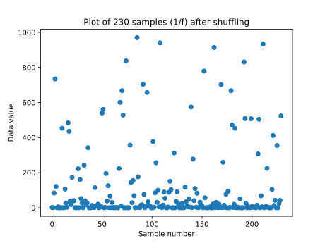
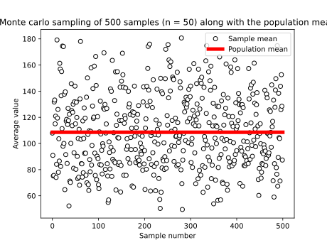
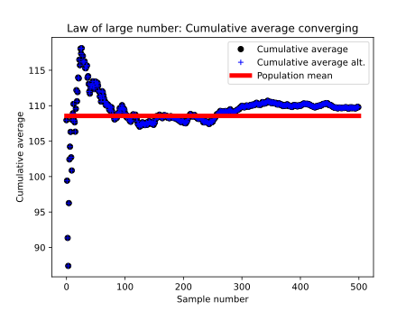
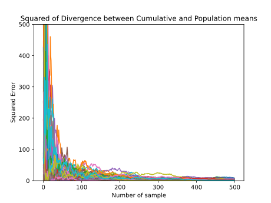
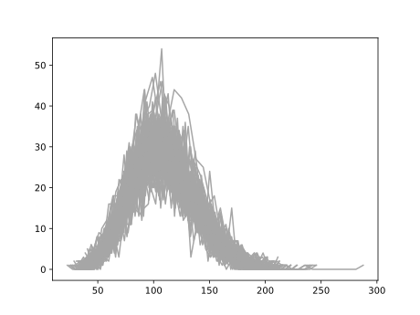

# Monte carlo sampling simulation and Law of large numbers

The simulation is about simulating monte carlo sampling of a continuous variable. Explore the law of large numbers through visualizations making cumulative averaging of the samples. Lastly central limit theorem has been explored through visualizing the distribution of sample means

## Problem
Any sample in statistical inference measurements is threatened by:
- Sensitive Variability
- Noise
- Other sources of non-systematic variation 

## Solution

**Law of large numbers**: as the number of experiment repetition increases, the average of the sample means better approximate the population mean

## Packages

* Numpy 
* Matplotlib.pyplot

## Steps

- Simulate Population of Random Numbers
- Explore the distribution of a random sample from the Population
- Perform Monte carlo sampling
- Explore the cumulative average convergence as the samples increases
- Explore Squared Error of divergence between the cumulative and population true means

## Results

# LawLargeNumbers
